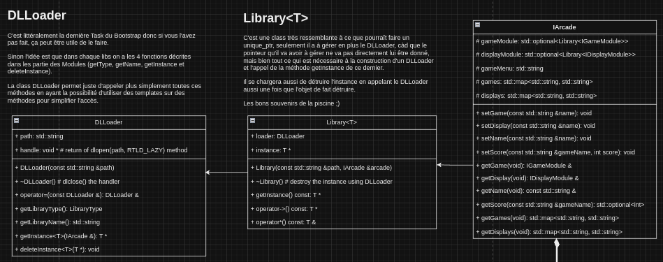
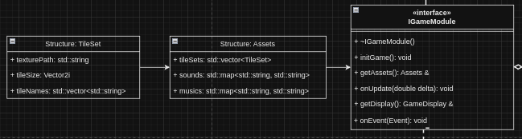
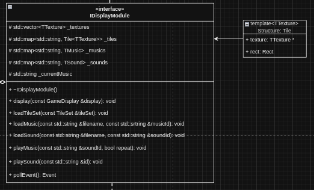
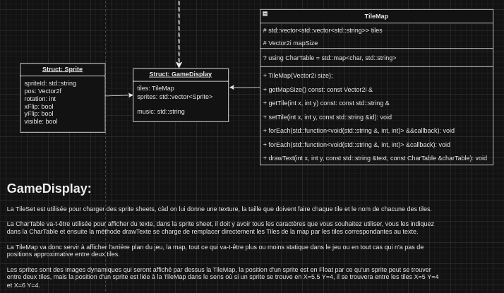
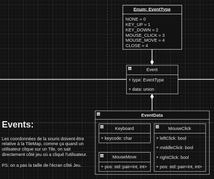
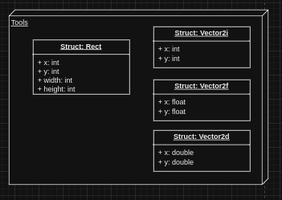
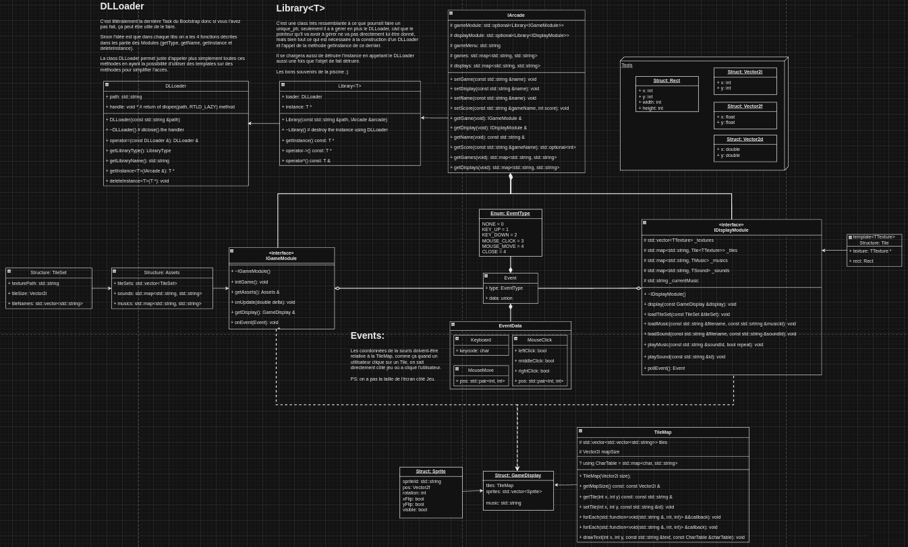

# Arcade Project Documentation

## Introduction

Welcome to the Arcade project documentation. This document aims to provide guidance on how to implement new graphics libraries or game libraries compatible with this Arcade system.

## Implementation Guidelines

### Graphics Libraries

To implement a new library compatible with this Arcade system, follow these guidelines:

1. **Folder**: Create a new folder in the `./lib/library` directory for the new library. The folder should contain the following files:
   - `LibraryName.hpp`: Header file for the library.
   - `LibraryName.cpp`: Implementation file for the library.
   - `Makefile`: Makefile for compiling the library.

2. **Class Definition**: Define a class in the `LibraryName.hpp` file that inherits from the `IDisplayModule` interface. The class should implement the following functions:
    - `LibraryName()`: Constructor for the library that initializes the window, renderer, etc.
    - `void display(const GameDisplay &display)`: Display the game display.
    - `void loadTileSet(const TileSet &tileSet)`: Load a tile set.
    - `void loadMusic(const std::string &filename, const std::string &musicId)`: Load music from a file.
    - `void loadSound(const std::string &filename, const std::string &soundId)`: Load sound from a file.
    - `void playMusic(const std::string &soundId, bool repeat) = 0;`: Play music with the specified ID.
    - `void playSound(const std::string &id)`: Play sound with the specified ID.
    - `Event &pollEvent()`: Poll for events.

3. **GameDisplay Struct**: The `GameDisplay` struct is a data structure that represents the current state of the game display. It is typically used to pass information from the game logic to the display module, which is responsible for rendering the game state to the screen. The `GameDisplay` struct includes fields such as a 2D array or grid representing the game map or board, information about the player, information about other game entities, and any other information that needs to be displayed. The `GameDisplay` struct is updated by the game logic each frame, and then passed to the `display` method of the display module to be rendered.

4. **TileSet Struct**: The `TileSet` struct is a data structure that represents a set of tiles that can be used in the game display. Each tile is a small image that can be used to build up larger scenes in 2D games. The `TileSet` includes a string representing the path to the image file that contains the tile images, a 2D size structure that specifies the width and height of each tile in the tileset, and a list of names or IDs for each tile in the tileset. These IDs can be used to refer to specific tiles when building up the game scenes.

5. **Class Implementation**: Implement the class defined in the `LibraryName.cpp` file. The implementation should include the necessary functions to interact with the library.

6. **Makefile**: Create a `Makefile` in the library folder to compile the library. The `Makefile` should include the necessary compilation flags and dependencies (look at other libraries' `Makefile` for reference).
    

### Game Libraries

To implement a new game compatible with the Arcade system, adhere to the following guidelines:

1. **Folder**: Create a new folder in the `./lib/games` directory for the new game. The folder should contain the following files:
   - `GameName.hpp`: Header file for the game.
   - `GameName.cpp`: Implementation file for the game.
   - `Makefile`: Makefile for compiling the game.

2. **Class Definition**: Define a class in the `GameName.hpp` file that inherits from the `IGameModule` interface. The class should implement the following functions:
    - `GameName()`: Constructor for the game that initializes tile sets, assets, music, sounds, high scores, etc.
    - `void initGame()`: Reset the game state.
    - `Assets &getAssets()`: Get the game assets.
    - `void onUpdate(double delta)`: Update the game state.
    - `bool GameDisplay &getDisplay()`: Get the game display.
    - `void onEvent(Event)`: Handle game events.

3. **How to load assets ?**: In order to load the necessary assets for the game, they must be added to the `tileSets` list within the `_assets` object. This is done using the `push_back` method, which appends a new element to the end of the list. The element to be added is an anonymous object with three properties: the path to the asset file, the size of the tiles, and a list of character names. Here is an example of how to add an asset:

```cpp
this->_assets.tileSets.push_back({"assets/font/font_white.png", {TILE_SIZE, TILE_SIZE}, charNamesArray});
```
In this line, `"assets/font/font_white.png"` is the path to the asset file, `{TILE_SIZE, TILE_SIZE}` specifies the size of the tiles (where TILE_SIZE is a predefined constant), and charNames is a list of character names.

The charNames will be a list of strings that will serve as the IDs for the assets. These IDs will be used to load assets by ID later in the game.

4. **Initializing the Game**: The `initGame` method is a crucial part of the game library. This method is called whenever the game needs to be restarted, such as when a new game is started or when the player chooses to replay after a game over. Therefore, the `initGame` method should reset the game state to its initial state. This includes resetting any game variables, clearing any game data structures, resetting the player's score and lives, repositioning game entities to their starting positions, and so on. Implementing this method correctly ensures that each new game starts from a clean slate, providing a consistent experience for the player.

4. **Class Implementation**: Implement the class defined in the `GameName.cpp` file. The implementation should include the necessary functions to interact with the game.

5. **Makefile**: Create a `Makefile` in the game folder to compile the game. The `Makefile` should include the necessary compilation flags and dependencies (look at other games' `Makefile` for reference).

## Game controls

1. **Game Controls**: The game can be controlled using the following keys:
    - **I**: Restart the game. This key resets the game state and starts a new game.
    - **O**: Change the game. This key allows the player to switch between different games.
    - **P**: Also used to change the game.
    - **K**: Go to the menu. This key brings up the game menu, where the player can choose options like starting a new game or exiting the game.
    - **L**: Change the library. This key allows the player to switch between different graphics libraries.
    - **M**: Also used to change the library.
    - **Enter**: Used to select
    - **ZQSD** or **Arrows**: Used for movement

## Architecture diagram

The following images illustrates the architecture of the Arcade system:








GLobal View of the architecture:



## Conclusion

By following these guidelines, you can implement new graphics libraries or game libraries compatible with the Arcade system. This ensures consistency, encapsulation, and proper handling of dynamic libraries within the project.